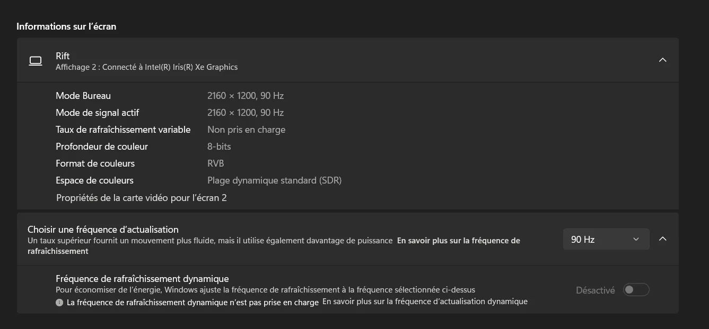

# Rift extended mode operation
So in this folder you will find the source code from [riftDriverPi](https://github.com/OhioIon/riftDriverPi/tree/master) that was adapted to work on windows.
Now as i am using an intel igpu i have some issues with getting the hmd to display, with an DP extended adapter(that's broken) it seems to be able to recognise the headset EDID of 2160x1200@90hz but the hmd does not want to light up...

Now using the hdmi on my laptop i get an 1920x1080@60hz resolution but i tried everything to force the 2160x1200@90hz setting with CRU (Custom Resolution Utility) to no avail...

Though, if you can get it to display then you will have a fun hacked night vision goggle with an oculus cv1
You could probably adapt it to work on linux, using the code from the [orginal repo](https://github.com/OhioIon/riftDriverPi/tree/master) and compile ["sensor" binary](/sensor/README.md) for linux !

## Build

For windows using msys ucrt64:
Install dependencies : 
```
$ pacman -S mingw-w64-ucrt-x86_64-hidapi
```

Build : 
```
$ gcc main.c rift.c -lhidapi -o hmd
```

## Power on !!
